# MetaGig Proposal: City Comment Resolution + Four-Project Site Plan Pipeline

**Prepared for:** Prospective small-business client  
**Status:** Provisional until the marked plan, city comments, and editable source drawings are reviewed  
**Recommended entry offer:** **$499 Site Plan Correction Assessment**, credited toward implementation if the client proceeds

## The answer the client needs

**Yes—MetaGig can help turn the city's comments into a coordinated revision package and establish a repeatable workflow for the four new builds.**

The outcome is not “an AI floor-plan tool.” The outcome is:

1. A current plan that is corrected, quality-checked, and ready for the appropriate professional to approve and resubmit.
2. A clear response to every city comment, with no item silently missed.
3. A reusable plan-production system for the next four properties.
4. Faster turnaround without asking the client to trust an unreviewed AI drawing.

The important boundary is that AI can accelerate comment extraction, drafting, comparison, and documentation; it does not replace the architect, engineer, surveyor, or other licensed professional whose review or seal may be required by the project’s jurisdiction.

> **Client-ready response**
>
> Yes. We can take the plan you already submitted, organize every city comment into a correction checklist, prepare the proposed revisions, and assemble a clean response-and-resubmission package. We can also use that first project to build a repeatable workflow for your four upcoming builds. First, we need the city’s marked comments, the latest submitted plan set, and—ideally—the original CAD files. We will tell you which changes can be completed directly, which need a licensed professional, and what the implementation will cost before any production work begins.

## Why this is a delivery problem, not a tool-shopping problem

The client already knows the pain point: the correction cycle is stalled, and four more projects are approaching. A generic discovery exercise would waste time. The first engagement should answer four practical questions:

- What exactly did the city reject or ask to clarify?
- Can the existing drawing be edited accurately, or must parts be redrawn?
- Which comments require architectural, civil, structural, surveying, drainage, fire-access, zoning, or other professional input?
- What repeatable components can be reused across the four future builds without ignoring parcel-specific requirements?

The three named products are primarily floor-plan and schematic-design products. A municipal **site plan** may also depend on legal boundaries, setbacks, easements, topography, utilities, grading, drainage, fire access, landscaping, zoning calculations, and a current survey. Those conditions are property-specific and cannot safely be inferred from a generated floor plan.

## The proposed $499 assessment

This adapts MetaGig’s four-phase assessment model to a client whose problem is already known.

### Phase 1 — Technical intake and source-file check

**30 minutes, not a broad discovery call.** We collect the city letter or portal comments, the full submitted plan set, editable drawing files, survey, property information, and deadline. We also identify the original professional and the person who can lawfully review or sign the revised package.

### Phase 2 — Comment-to-sheet analysis

Every city comment is converted into a controlled matrix containing:

- the exact comment and reviewer discipline;
- affected sheet, detail, and drawing element;
- proposed response and proposed drawing change;
- missing information or required professional decision;
- responsible person, status, and evidence of completion.

AI accelerates extraction and cross-checking. A human reviews every row against the source document.

### Phase 3 — Correction blueprint

MetaGig delivers:

- a prioritized city-comment matrix;
- a source-file viability finding—direct CAD edit, partial redraw, or redline-only package;
- a list of unresolved information and professional disciplines required;
- the proposed revision, quality-assurance, and resubmission workflow;
- a scope, schedule, and implementation quote for the current plan;
- a reusable production blueprint for the four new builds.

### Phase 4 — Decision review

In a 30-minute walkthrough, the client sees what can be fixed immediately, what requires outside approval, and the fastest responsible route to resubmission. If the client selects MetaGig for implementation, the proposed **$499 assessment fee is credited toward that work**.

The assessment does not promise municipal approval. It replaces uncertainty with a defensible correction plan before the client spends on full production.

## Recommended delivery plan

### Workstream A — Rescue the current submission

1. Preserve the original submission and create a versioned working copy.
2. Extract every city comment from the letter, portal export, and marked sheets.
3. Map each comment to its sheet, detail, and required decision.
4. Prepare proposed redlines and obtain client/professional approval before changing CAD.
5. Revise the editable drawings. If no editable files exist, produce a detailed redline package and quote the necessary redraw.
6. Run geometry, dimension, layer, annotation, and comment-completeness checks.
7. Obtain the required licensed review and signature/seal, where applicable.
8. Deliver the complete corrected set, response narrative, comparison copy, and source files for resubmission.

### Workstream B — Produce the four new-build plan packages

1. Create a common standards kit: title blocks, layers, naming, reusable symbols, checklists, response-matrix template, and version-control rules.
2. Collect a separate survey, zoning information, program, utilities, access, grading/drainage conditions, and jurisdiction requirements for each parcel.
3. Use fast schematic tools to explore layouts only where useful.
4. Convert the selected concept into controlled CAD/BIM geometry.
5. Complete parcel-specific site-plan coordination and professional review.
6. Apply the lessons from the first city review to the remaining projects.

The first new build should be treated as the **pilot template**. The other three can then reuse the validated process—not blindly copy the plan.

### Workstream C — Add a private revision copilot only after the pilot

Once the real correction workflow is understood, MetaGig can build a private workspace that:

- ingests city letters, marked PDFs, submitted drawings, and surveys;
- turns review comments into structured correction tasks;
- links each task to the relevant sheet and proposed response;
- lets a human approve or reject every proposed CAD operation;
- creates comparison sheets, revision logs, and response narratives;
- preserves original, proposed, approved, and issued versions;
- flags missing inputs instead of inventing measurements or code conclusions.

This is where custom software creates leverage. Building it before examining a real project would automate assumptions rather than a proven process.

## How the workflow fits together

```mermaid
flowchart LR
    A["City comments + submitted plan + CAD + survey"] --> B["Extract and classify every comment"]
    B --> C["Comment-to-sheet correction matrix"]
    C --> D["Human and professional approval"]
    D --> E["Controlled CAD revisions"]
    E --> F["Drawing QA + comment completeness check"]
    F --> G["Licensed review where required"]
    G --> H["Corrected set + response package + audit trail"]
```

## Solution options

| Option | Outcome | Best use | Recommendation |
|---|---|---|---|
| **1. Managed correction pilot** | The current submission is converted into a reviewed correction and resubmission package | Immediate deadline and uncertain source quality | **Start here** |
| **2. Managed pipeline + private revision copilot** | Current correction plus a repeatable, auditable workflow for all four new builds | Recurring plan volume after the pilot proves the process | Build next |
| **3. Client-operated floor-plan generator** | Rapid concepts and presentation images | Early ideation only | Do not use as the permit workflow |

## Where the named products can help—and where they cannot

| Product | Useful contribution | Do not rely on it for |
|---|---|---|
| [FloorAI](https://www.floorai.ai/) | Rapid redraws, visual edits, and possible DXF handoff when digitizing an existing layout | Municipal code checking, survey accuracy, or an unreviewed permit revision |
| [AIHousePlan](https://aihouseplan.app/) | Fast 2D/2.5D/3D concept images from prompts and reference images | Construction or submission drawings; its own product guidance says generated plans require professional follow-through |
| [Drafted](https://www.drafted.ai/) | Early residential schematic options and CAD/BIM-oriented exports | A finished, permit-ready set; its documentation positions it as an early-design tool |

**Finding:** none of these products, by itself, solves the client’s stated outcome. They may shorten selected steps inside a managed workflow. The value MetaGig sells is coordinated correction, review, and resubmission—not access to a generator.

## Recommended software foundation

### Production recommendation

Build the controlled geometry and revision service on [mozman/ezdxf](https://github.com/mozman/ezdxf), a mature MIT-licensed Python library for reading, modifying, validating, and writing DXF files. Use it as the deterministic CAD engine: the AI proposes structured changes, but approved code applies them and logs the result.

Add:

- [Docling](https://github.com/docling-project/docling) for document layout and PDF extraction;
- [PaddleOCR](https://github.com/PaddlePaddle/PaddleOCR) when marked scans require OCR;
- the official [OpenAI Apps SDK examples](https://github.com/openai/openai-apps-sdk-examples) for a private ChatGPT interface;
- the OpenAI Responses API for multimodal document analysis and constrained tool calls.

### AutoCAD environment option

If the client or drafting partner uses AutoCAD LT 2024 or later, [puran-water/autocad-mcp](https://github.com/puran-water/autocad-mcp) is the most direct prototype adapter for opening drawings, editing entities, dimensions, leaders, layers, and blocks, and plotting outputs. It should be sandboxed and limited to approved operations; it is an integration layer, not a code or permit expert.

### Site-plan-specific prototype to evaluate

[thebossnow/aiblueprint-mcp](https://github.com/thebossnow/aiblueprint-mcp) is a promising site-plan-oriented reference with DXF editing, dimensions, parcel/GeoJSON handling, exports, and undo support. It is young, and its repository licensing should be verified before any commercial fork. Treat it as a pilot/reference implementation, not the sole production dependency.

### OpenAI integration—not a vague “ChatGPT work plugin”

The current implementation path is a **custom ChatGPT app/plugin backed by an MCP server**, or a standalone MetaGig portal using the OpenAI API. The app exposes narrow actions such as:

- `extract_city_comments`
- `map_comment_to_sheet`
- `propose_revision`
- `approve_revision`
- `apply_dxf_change`
- `compare_versions`
- `export_resubmission_package`

OpenAI’s [Apps SDK documentation](https://developers.openai.com/apps-sdk/) and [connector/app guidance](https://help.openai.com/en/articles/11487775-connectors-in-chatgpt) describe the supported route. The system can be built with Codex and does not require Claude.

## Human-control and acceptance standards

Implementation is successful only when:

- every city comment has a unique ID, owner, status, affected sheet, response, and completion evidence;
- every drawing change can be traced to an approved comment or documented design decision;
- revised areas are clearly identified in the issue set;
- dimensions and geometry are compared against the source and known survey data;
- unresolved questions are visible and cannot be silently marked complete;
- source, working, approved, and issued versions are preserved;
- the appropriate licensed professional reviews and signs/seals the work where required;
- the client receives editable sources, the issued PDF set, a comparison copy, and the response narrative.

AI output must be treated as a draft until qualified review. [NCARB’s position on AI](https://www.ncarb.org/press/ncarb-position-on-ai) keeps professional judgment and responsible control with the licensed practitioner. City procedures vary, but official examples from [Seattle](https://www.seattle.gov/construction-and-inspections/permits/how-to-respond-to-review-comments) and [Austin](https://www.austintexas.gov/development-services/residential-plan-review) illustrate why a complete response narrative and clearly identified drawing revisions matter.

## Information required to start

### Current correction

- project city/state, property address or parcel number, permit/application number, and resubmission deadline;
- complete city correction letter, portal comments, checklists, and marked sheets;
- latest full plan set exactly as submitted;
- editable DWG/DXF/Revit/SketchUp files, including Xrefs, fonts, title blocks, and linked files;
- current survey/topography, legal description, property lines, easements, setbacks, utilities, grading/drainage information, access/fire requirements, and related calculations;
- name and status of the original architect, engineer, surveyor, or drafter;
- written confirmation that the client has the right to reuse and modify the source files;
- identification of the professional who will review and sign/seal the revision if required.

### Four new builds

- one intake package per parcel: address/APN, jurisdiction, survey, zoning, intended program, footprint, utility strategy, access, site constraints, and desired schedule;
- which elements are intended to be standardized across all four builds;
- who owns final design decisions and professional submission responsibility.

## Material risks and how the proposal controls them

| Risk | Control |
|---|---|
| Only a flattened PDF is available | Produce a redline/change package first; quote redraw separately rather than promise precise CAD edits |
| “Site plan” actually includes civil, survey, grading, drainage, or structural work | Identify each discipline during the assessment and route it to the qualified professional |
| Source-file ownership or original professional is unclear | Confirm modification rights and responsible professional before production |
| AI invents a dimension, code rule, or site condition | Require source evidence, deterministic validation, and human approval; unresolved fields remain blocked |
| City adds new comments | Maintain a versioned matrix and change log; define additional review cycles separately |
| Four parcels differ materially | Standardize the workflow and components, not unverified property conditions |

## Recommended next move

1. Reattach `SP.pdf` or export the complete city comment package from the permit portal.
2. Add the exact submitted plan set and any editable CAD files.
3. Run the **$499 Site Plan Correction Assessment**.
4. Approve a fixed implementation scope for the current correction.
5. Use the corrected project plus one new-build pilot to validate the repeatable pipeline.
6. Build the private revision copilot only after those real workflows are proven.

## Current limitation

The referenced `C:\Users\Honri\Downloads\SP.pdf` was not present when this proposal was prepared. Consequently, this document does **not** claim to interpret the city’s actual comments, identify affected sheets, or estimate the final revision effort. Those findings belong in the project-specific comment matrix after the PDF and drawing sources are available.

## Source notes

- MetaGig, *Business Automation Assessment*, slide 2: four-phase assessment and $499 decision-point model.
- [FloorAI](https://www.floorai.ai/)
- [AIHousePlan](https://aihouseplan.app/) and [pricing](https://aihouseplan.app/pricing)
- [Drafted FAQ](https://www.drafted.ai/learn/faq), [AI for drafters](https://www.drafted.ai/learn/ai-for-drafters), and [use cases](https://www.drafted.ai/learn/use-cases)
- [OpenAI Apps SDK](https://developers.openai.com/apps-sdk/) and [ChatGPT connectors/apps guidance](https://help.openai.com/en/articles/11487775-connectors-in-chatgpt)
- [NCARB position on AI](https://www.ncarb.org/press/ncarb-position-on-ai)
- [Seattle guidance for responding to review comments](https://www.seattle.gov/construction-and-inspections/permits/how-to-respond-to-review-comments)
- [Austin residential plan-review guidance](https://www.austintexas.gov/development-services/residential-plan-review)
- GitHub repositories: [ezdxf](https://github.com/mozman/ezdxf), [autocad-mcp](https://github.com/puran-water/autocad-mcp), [aiblueprint-mcp](https://github.com/thebossnow/aiblueprint-mcp), [Docling](https://github.com/docling-project/docling), [PaddleOCR](https://github.com/PaddlePaddle/PaddleOCR), and [OpenAI Apps SDK examples](https://github.com/openai/openai-apps-sdk-examples)

